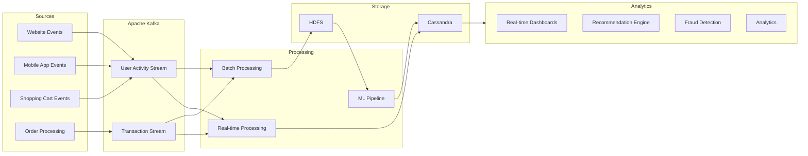

# ByteBasket
A distributed data pipeline demonstrating real-time processing and analytics of e-commerce events using modern big data technologies.

[](https://opensource.org/licenses/MIT)
[](http://makeapullrequest.com)
[](https://github.com/yourusername/blazingly-fast-dev/issues)



## Tech Stack
- Apache Kafka: Event streaming and message queuing
- Apache Spark: Distributed data processing
- Apache Cassandra: NoSQL database for real-time queries
- HDFS: Distributed storage for large datasets
- Python: Primary implementation language

## System Components

### Event Producers
- User activity tracking
- Shopping cart events
- Transaction processing
- Mock data generation for testing

### Data Processing
- Real-time stream processing with Spark Streaming
- Basic ML pipeline for recommendations
- Fraud detection system
- Analytics computations

### Storage Layer
- Cassandra tables optimized for real-time queries
- HDFS structure for efficient data access
- Data retention policies

### Analytics
- Real-time metrics dashboard
- Historical trend analysis
- Product recommendations
- Transaction monitoring

## Setup and Development

### Prerequisites
- Python 3.12+
- Docker & Docker Compose
- uv package manager

### Project Initialization
```bash
# Create new project
uv init bytebasket
cd bytebasket

# Install dependencies
uv add kafka-python==2.0.2
uv add pyspark
uv add cassandra-driver
uv add grpcio-tools==1.66.1
uv add protobuf==5.27.2
uv add pytest
```

### Kafka Setup
```bash
# Start Kafka cluster (KRaft mode)
docker compose up -d

# Verify Kafka cluster status
docker exec kafka1 kafka-topics.sh --bootstrap-server localhost:9092 --list
```

## Project Structure
```
bytebasket/
├── .venv/
├── .python-version
├── pyproject.toml
├── uv.lock
├── docker-compose.yml
├── config/
│   ├── kafka.yml
│   ├── spark.yml
│   └── cassandra.yml
├── src/
│   ├── producers/
│   │   ├── __init__.py
│   │   ├── user_events.py
│   │   ├── cart_events.py
│   │   └── transaction_events.py
│   ├── processors/
│   │   ├── __init__.py
│   │   ├── stream_processor.py
│   │   ├── fraud_detector.py
│   │   └── recommender.py
│   ├── storage/
│   │   ├── __init__.py
│   │   ├── cassandra_client.py
│   │   └── hdfs_client.py
│   └── analytics/
│       ├── __init__.py
│       └── metrics.py
├── tests/
│   ├── test_producers.py
│   ├── test_processors.py
│   └── test_storage.py
└── notebooks/
    └── analysis.ipynb
```

### Kafka Configuration
- 4 partitions per topic (scalable)
- Replication factor: 1 (development) / 3 (production)
- Key-based partitioning for user consistency
- Exactly-once semantics enabled

### Development Guidelines
1. All messages use Protocol Buffers serialization
2. Producers must enable idempotence and `acks=all`
3. Consumers implement at-least-once processing
4. Use atomic writes for output files

## Development Status
Proof-of-concept project demonstrating distributed systems architecture.

## Production Considerations
- Increase replication factor to 3
- Enable SSL/TLS encryption
- Implement proper ACLs
- Configure message retention policies
- Set up monitoring and alerting
